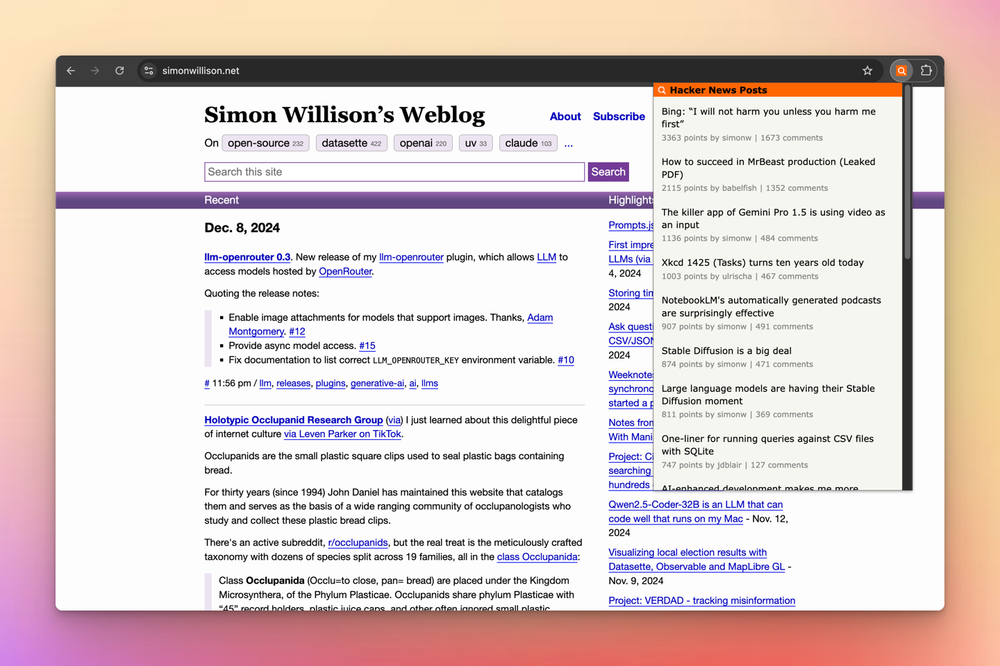

# Hacker News Lookup Chrome Extension

A Chrome extension that shows you if the current webpage has been discussed on Hacker News. If discussions exist, it displays links to them along with points and comments. If no discussions are found, it offers a direct link to submit the page to Hacker News.

## Install
[Download in Chrome Web Store](https://chromewebstore.google.com/detail/hacker-news-lookup/peimjccjdnehmghjaejlhonmakcamghf)

## License

This project is licensed under the MIT License. See the [LICENSE](LICENSE) file for more details.
